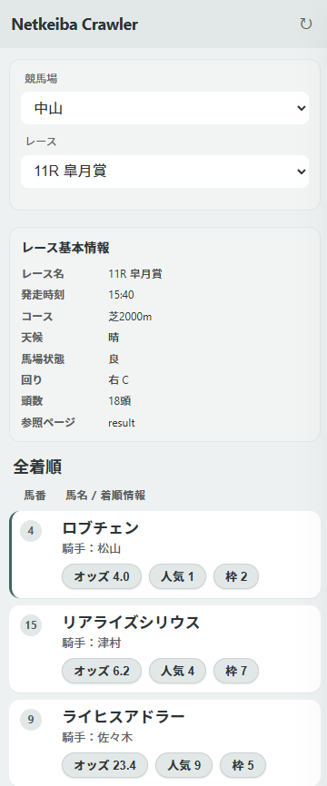
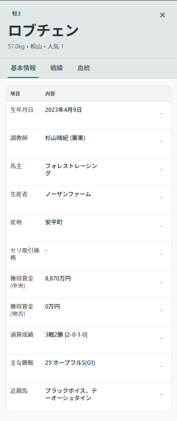

# Keiba Data Crawler（Chrome 拡張）

Netkeiba のレース情報を取得し、サイドパネルで確認するための Chrome 拡張です。  
レース一覧、出走馬、オッズ、馬詳細を簡単に確認できます。

## 主な機能

- レース一覧の取得
- 競馬場・レースの選択
- 選択したレースの出走馬情報とオッズ表示
- 馬詳細パネルの表示

## セットアップ

```bash
npm install
```

## ビルド

```bash
npm run build
```

開発中に自動ビルドしたい場合:

```bash
npm run watch
```

## Chrome への読み込み方法

1. `npm run build` を実行
2. Chrome で `chrome://extensions` を開く
3. 右上の「デベロッパーモード」を有効化
4. 「パッケージ化されていない拡張機能を読み込む」をクリック
5. このプロジェクトの `dist` フォルダを選択

## 使い方

1. 拡張のサイドパネルを開く
2. ヘッダーの更新ボタン（↻）でレース一覧を取得
3. 競馬場とレースを選択
4. 馬一覧を確認し、行をクリックして馬詳細を表示

## スクリーンショット（プレースホルダー）

下記は仮の画像です。実際のスクリーンショットを撮影したら、同じファイル名で置き換えてください。

### 1) レース選択



### 2) 馬詳細パネル



## 画像の追加・差し替え方法

1. `docs/images` フォルダに画像ファイルを追加します。
2. 既存のプレースホルダーを差し替える場合は、同じファイル名で上書きします。
3. 新しい画像を追加する場合は、README に以下の形式で追記します。

```md
### 追加したい見出し

```

### 推奨設定

- 形式: `png` または `jpg`
- 横幅: 1200px 以上
- 比率: 16:9 または 4:3
- ファイル名: 英数字とハイフンのみ（例: `race-details-01.png`）

## 利用可能なコマンド

- `npm run dev`: Vite 開発サーバー
- `npm run build`: 本番ビルド
- `npm run watch`: ビルドの監視
- `npm run lint`: ESLint 実行
- `npm run preview`: ビルド結果の確認

## 補足

- アイコンや manifest の変更後は、`chrome://extensions` で拡張を再読み込みしてください。
